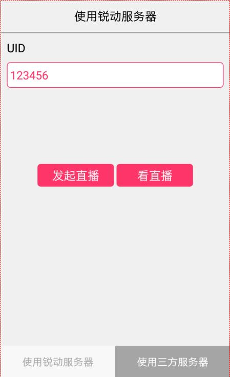
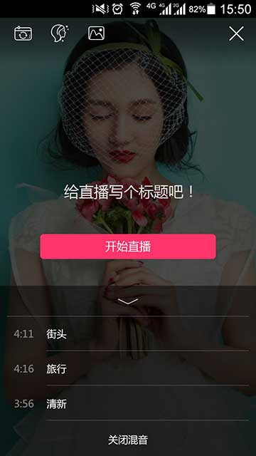

# 锐动直播SDK android版
&emsp;&emsp;通过android移动端实时采集视频，同时在拍摄过程中支持多种实时滤镜效果，只要调用视频直播接口，通过3G、4G、WIFI等网络，推流发送给云端流媒体直播系统处理，并通过CDN视频加速分发做现场直播播出，供远程观看，是一款专业级水平的视频直播开发包。同时，在节目直播过程中，直播视频可归档、存储，方便后续回看。视频直播SDK不断优化视频采集和处理能力，让开发者更专注自身业务应用开发和运营。

-------------------

###SDK功能介绍:
####1.直播推流
* **实时美颜**	
* **摄像头切换** 前、后摄像头自由切换，中间无卡顿
* **滤镜** 	内置主流滤镜，支持扩展更多滤镜
* **协议** 	RTMP协议，支持主流服务器
* **编码与设置**  支持H264及AAC编码；支持智能硬件编码；支持自定义分辨率、码率、帧率
* **静音** 支持实时静音与取消静音
* **内置伴音** 主播可以高质量卡拉OK及喊麦主持
* **可定制的水印**
* **界面可定制** 当前已经实现了通用的界面，也可根据实际业务进行扩展
* **云服务器** 支持锐动云服务器推流(UID直播推流)，也支持使用第三方云服务器（URL直播推流)。
* **支持横竖屏**
	
####2.播放器
* **低延迟**
* **协议** 	支持RTSP/RTMP协议，支持主流服务器
* **支持自定义布局**
* **静音** 支持实时静音与取消静音
* **支持横竖屏**

####&emsp;截图
  

###关于授权：

www.rdsdk.com 致力于专业的人做专业的事，降低客户的开发时间和开发成本，你只需要支付很少的费用，花上几个小时就能增加直播及回放功能。

[单击申请试用](http://dianbook.17rd.com/business/verify/login)

**开发文档:**

[点击查看](https://rdsdk.github.io/rdLiveSDK-for-Android/Android%E9%94%90%E5%8A%A8%E6%89%8B%E6%9C%BA%E7%9B%B4%E6%92%ADSDK%E6%96%87%E6%A1%A3.pdf)

**JAVA接口文档:**

[点击查看](https://rdsdk.github.io/rdLiveSDK-for-Android/RDLiveSDK/docs/com.rd.live/index.html)

###洽谈咨询：

**咨询电话: 4008989105**

**客服电话: 15313066905 (周一至周五 9:00-18:00)**

**客服邮箱：<2637433751@qq.com>**

